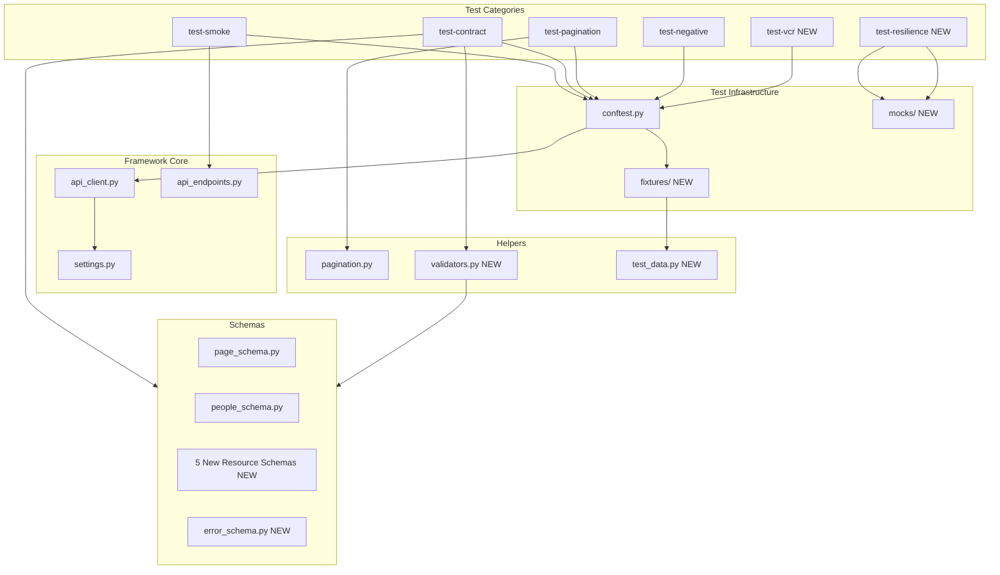
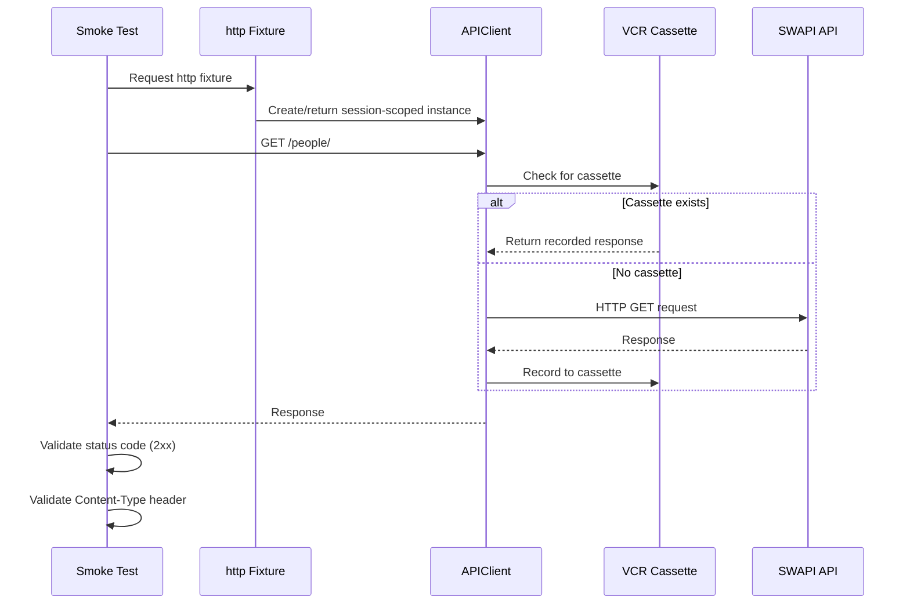
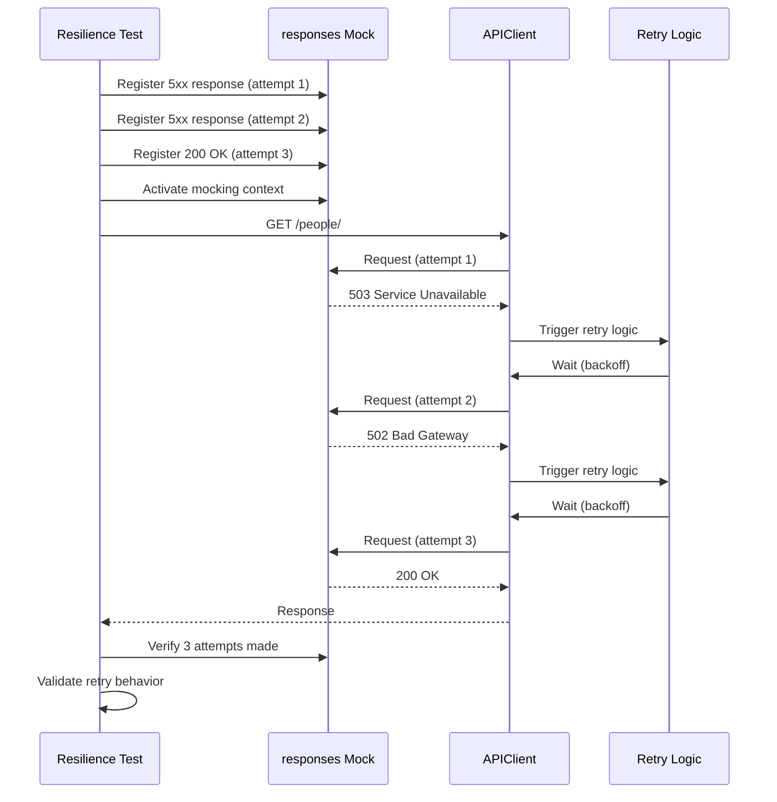
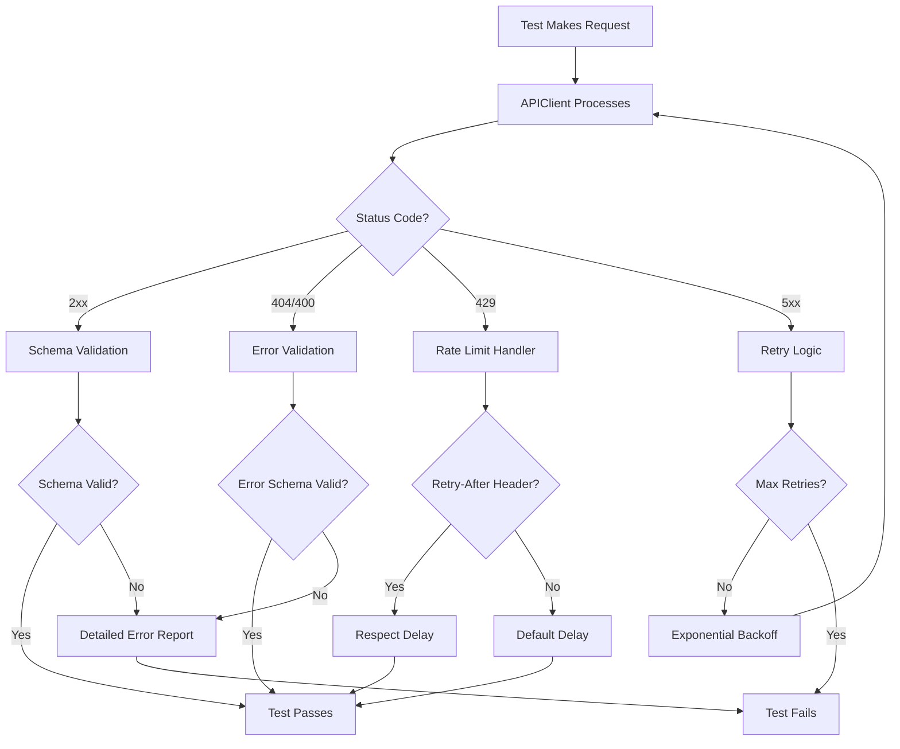

# Technical Design: Enhanced Test Coverage

## Overview

This feature expands the API Batch Test Framework's test coverage from basic smoke/contract/pagination/negative testing of the `/people/` endpoint to comprehensive coverage of all SWAPI resources (people, films, starships, vehicles, species, planets). It introduces testing infrastructure for HTTP client resilience validation, VCR functionality verification, enhanced test data management, and improved diagnostic capabilities.

**Purpose**: Deliver comprehensive test coverage that validates API contract compliance, error handling, edge cases, and framework resilience features, ensuring confidence in both the API behavior and the test framework itself.

**Users**: QA engineers and developers will utilize this for validating API reliability, debugging test failures, and maintaining test infrastructure.

**Impact**: Extends existing test framework from 5 active tests (2 skipped) covering 1 endpoint to 50+ tests covering 6 endpoints plus framework features, organized across 7 test categories with enhanced reporting and parallel execution support.

### Goals
- Comprehensive smoke test coverage for all 6 SWAPI resource types
- Complete schema validation for all API responses with detailed error reporting
- Thorough negative testing including error codes, timeouts, retries, and boundary conditions
- Pagination integrity validation across all paginated endpoints
- HTTP client resilience feature verification (retry, timeout, rate limiting)
- VCR functionality testing to ensure recording/replay reliability
- Centralized test data management with fixtures, factories, and JSON support
- Enhanced diagnostic output for faster debugging
- Parallel execution support with pytest-xdist

### Non-Goals
- Testing non-SWAPI APIs or adding multi-API support
- Performance/load testing beyond basic smoke test timing
- Custom test reporters beyond pytest-reporter-html1
- Authentication/authorization testing (SWAPI is public, no auth)
- Mutation testing (SWAPI is read-only, GET-only)
- Schema generation from API (manual schema creation only)

## Architecture

### Existing Architecture Analysis

**Current Structure**:
- **Test Organization**: Category-based directories (`test-smoke/`, `test-contract/`, `test-pagination/`, `test-negative/`)
- **Core Framework**: `APIClient` class with retry, rate limiting, timeout support
- **Configuration**: Environment-based settings (`config/settings.py`)
- **Schema Validation**: `jsonschema` library with manual schema definitions
- **VCR Integration**: Session-scoped cassette configuration in `conftest.py`
- **Fixtures**: Session-scoped `http` and `base_url` fixtures

**Integration Points to Maintain**:
- Session-scoped APIClient fixture (supports pytest-xdist parallel execution)
- VCR cassette directory and configuration
- Pytest marker system (smoke, contract, pagination, negative, heavy, vcr)
- Absolute imports from project root

**Technical Debt Addressed**:
- Skipped tests due to API changes → More VCR usage for deterministic testing
- Limited endpoint coverage → Expand to all 6 resource types
- No resilience testing → Add mocked resilience test suite
- Basic diagnostics → Enhanced error reporting

### Architecture Pattern & Boundary Map



**Architecture Integration**:
- **Selected pattern**: Test-category-first organization with layered infrastructure (existing pattern preserved)
- **Domain boundaries**:
  - Test categories remain isolated (can run independently)
  - Shared infrastructure (fixtures, helpers) provides common utilities
  - Core framework (APIClient, settings) unchanged except for new endpoint constants
- **Existing patterns preserved**:
  - Session-scoped fixtures for expensive resources
  - Absolute imports from project root
  - Snake_case for files/functions, PascalCase for classes
  - Pytest markers for test categorization
- **New components rationale**:
  - `test-resilience/` - Distinct concern (testing framework vs. testing API)
  - `test-vcr/` - VCR is infrastructure feature, separate from API tests
  - `fixtures/` - Centralized test data management (prevents conftest.py bloat)
  - `mocks/` - Isolation of mock responses from test logic
  - `validators.py` - Enhanced error reporting (wrapper around jsonschema)
  - `test_data.py` - JSON loading utilities (reusable across tests)
- **Steering compliance**:
  - Test-category-first organization maintained
  - Type hints for all new functions
  - Session-scoped fixtures for APIClient
  - VCR for deterministic testing
  - Parametrization for test efficiency

### Technology Stack

| Layer | Choice / Version | Role in Feature | Notes |
|-------|------------------|-----------------|-------|
| **Testing Framework** | pytest (latest) | Core test runner, fixture management | Already present |
| **Parallel Execution** | pytest-xdist (latest) | Parallel test execution | Already present |
| **HTTP Mocking** | responses 0.25+ | Mock HTTP responses for resilience tests | **NEW** - chosen over requests-mock for simplicity |
| **HTTP Recording** | vcrpy (latest) | Record/replay HTTP interactions | Already present |
| **Schema Validation** | jsonschema (latest) | JSON schema validation | Already present |
| **HTTP Client** | requests (latest) | HTTP communication | Already present |
| **Test Reporting** | pytest-reporter-html1 (latest) | HTML test reports | Already present |
| **Configuration** | python-dotenv (latest) | Environment variables | Already present |
| **Type Checking** | mypy (latest) | Static type checking | Already present |

**New Dependency Justification**:
- **responses**: Required for mocking HTTP error scenarios (429, 5xx), timeout testing, and retry verification without live API dependency. Selected over alternatives (requests-mock, pytest-mock) for simpler API and better documentation (see research.md for comparison).

## System Flows

### Smoke Test Execution Flow



**Key Decisions**: VCR.py records on first run (`record_mode="once"`), replays on subsequent runs for deterministic testing without live API dependency.

### Resilience Test Flow with Mocking



**Key Decisions**: Use `responses` library to register multiple responses for same endpoint, enabling verification of retry attempts and backoff behavior without live API dependency.

## Requirements Traceability

| Requirement | Summary | Components | Interfaces | Flows |
|-------------|---------|------------|------------|-------|
| 1.1-1.5 | Enhanced Smoke Test Coverage | test-smoke/, api_endpoints.py | Endpoints class, smoke test functions | Smoke Test Execution Flow |
| 2.1-2.7 | Expanded Contract Validation | test-contract/, schemas/, validators.py | validate_schema(), resource schemas | Schema Validation Flow |
| 3.1-3.10 | Comprehensive Negative Testing | test-negative/, mocks/ | parametrized tests, mock fixtures | Error Response Flow |
| 4.1-4.10 | Enhanced Pagination Testing | test-pagination/, pagination.py | iter_pages(), pagination validators | Pagination Traversal Flow |
| 5.1-5.7 | HTTP Client Resilience Testing | test-resilience/, mocks/ | APIClient, mock responses | Resilience Test Flow |
| 6.1-6.8 | VCR Recording/Replay Testing | test-vcr/, conftest.py | vcr_config fixture | VCR Recording Flow |
| 7.1-7.5 | Parametrized Test Coverage | test-negative/, test-contract/ | @pytest.mark.parametrize | Parametrized Test Execution |
| 8.1-8.5 | Test Data Management | fixtures/, test_data.py | load_json_data(), factories | Test Data Loading Flow |
| 9.1-9.7 | Test Reporting/Diagnostics | validators.py, pytest hooks | format_diagnostic_output() | Enhanced Error Reporting |
| 10.1-10.5 | Parallel Execution Support | conftest.py, test markers | session-scoped fixtures | Parallel Test Execution |

## Components and Interfaces

### Component Summary

| Component | Domain/Layer | Intent | Req Coverage | Key Dependencies (Criticality) | Contracts |
|-----------|--------------|--------|--------------|-------------------------------|-----------|
| Endpoints | Core | Centralized API path constants | 1.1 | None | Service |
| Resource Schemas | Core | JSON schema definitions for API resources | 2.1, 2.2, 2.3, 2.4 | jsonschema (P0) | State |
| Error Schema | Core | JSON schema for error responses | 2.5, 3.6 | jsonschema (P0) | State |
| Schema Validators | Helpers | Enhanced schema validation with diagnostics | 2.5, 2.6, 2.7, 9.2, 9.3 | jsonschema (P0), schemas (P0) | Service |
| Test Data Loader | Helpers | Load test data from JSON files | 8.3 | json (P0) | Service |
| Mock Fixtures | Test Infrastructure | Reusable mock response fixtures | 3.1-3.10, 5.1-5.7 | responses (P0) | Service |
| Smoke Tests | Test Category | Endpoint availability validation | 1.1-1.5 | http fixture (P0), Endpoints (P0) | N/A |
| Contract Tests | Test Category | Schema compliance validation | 2.1-2.7 | http fixture (P0), validators (P0), schemas (P0) | N/A |
| Pagination Tests | Test Category | Pagination integrity validation | 4.1-4.10 | http fixture (P0), iter_pages (P0) | N/A |
| Negative Tests | Test Category | Error scenario validation | 3.1-3.10 | http fixture (P0), mocks (P1) | N/A |
| Resilience Tests | Test Category | HTTP client feature validation | 5.1-5.7 | APIClient (P0), mocks (P0) | N/A |
| VCR Tests | Test Category | VCR functionality validation | 6.1-6.8 | vcr_config fixture (P0) | N/A |

### Core Domain

#### Endpoints (Extended)

| Field | Detail |
|-------|--------|
| Intent | Centralized API endpoint path constants for all SWAPI resources |
| Requirements | 1.1 |

**Responsibilities & Constraints**
- Provide class constants for all API endpoint paths
- Support path parameter substitution patterns (e.g., `{id}`)
- Maintain backward compatibility with existing PEOPLE and PEOPLE_ID constants

**Dependencies**
- None (pure data class)

**Contracts**: Service [x]

##### Service Interface
```python
from typing import Final

class Endpoints:
    """Centralized API endpoint paths for SWAPI resources."""

    # Collection endpoints (paginated)
    PEOPLE: Final[str] = "/people/"
    FILMS: Final[str] = "/films/"
    STARSHIPS: Final[str] = "/starships/"
    VEHICLES: Final[str] = "/vehicles/"
    SPECIES: Final[str] = "/species/"
    PLANETS: Final[str] = "/planets/"

    # Individual resource endpoints (with ID placeholder)
    PEOPLE_ID: Final[str] = "/people/{id}/"
    FILMS_ID: Final[str] = "/films/{id}/"
    STARSHIPS_ID: Final[str] = "/starships/{id}/"
    VEHICLES_ID: Final[str] = "/vehicles/{id}/"
    SPECIES_ID: Final[str] = "/species/{id}/"
    PLANETS_ID: Final[str] = "/planets/{id}/"

    # Schema endpoints (optional, for future use)
    PEOPLE_SCHEMA: Final[str] = "/people/schema/"
    FILMS_SCHEMA: Final[str] = "/films/schema/"
    STARSHIPS_SCHEMA: Final[str] = "/starships/schema/"
    VEHICLES_SCHEMA: Final[str] = "/vehicles/schema/"
    SPECIES_SCHEMA: Final[str] = "/species/schema/"
    PLANETS_SCHEMA: Final[str] = "/planets/schema/"
```

- **Preconditions**: None
- **Postconditions**: Constants are immutable strings
- **Invariants**: All paths start with `/` and end with `/`

**Implementation Notes**
- Integration: Used by all test categories for consistent endpoint references
- Validation: Type checker ensures Final strings are not modified
- Risks: None (pure data, no logic)

#### Resource Schemas

| Field | Detail |
|-------|--------|
| Intent | JSON schema definitions for all SWAPI resource types (films, starships, vehicles, species, planets) |
| Requirements | 2.1, 2.2, 2.3, 2.4 |

**Responsibilities & Constraints**
- Define JSON schema for each resource type's response structure
- Include required fields, types, formats, and constraints
- Support optional field validation
- Follow existing page_schema.py and people_schema.py patterns

**Dependencies**
- Outbound: jsonschema library - Schema validation (P0)

**Contracts**: State [x]

##### State Management
```python
from typing import TypedDict, Dict, Any

# Type hints for schema structure
ResourceSchema = Dict[str, Any]

# Example: films_schema.py
FILMS_ITEM_SCHEMA: ResourceSchema = {
    "type": "object",
    "required": ["title", "episode_id", "opening_crawl", "director", "producer",
                 "release_date", "characters", "planets", "starships", "vehicles",
                 "species", "created", "edited", "url"],
    "properties": {
        "title": {"type": "string", "minLength": 1},
        "episode_id": {"type": "integer", "minimum": 1},
        "opening_crawl": {"type": "string"},
        "director": {"type": "string"},
        "producer": {"type": "string"},
        "release_date": {"type": "string", "pattern": "^\\d{4}-\\d{2}-\\d{2}$"},
        "characters": {
            "type": "array",
            "items": {"type": "string", "pattern": "^https?://"}
        },
        "planets": {
            "type": "array",
            "items": {"type": "string", "pattern": "^https?://"}
        },
        "starships": {
            "type": "array",
            "items": {"type": "string", "pattern": "^https?://"}
        },
        "vehicles": {
            "type": "array",
            "items": {"type": "string", "pattern": "^https?://"}
        },
        "species": {
            "type": "array",
            "items": {"type": "string", "pattern": "^https?://"}
        },
        "created": {"type": "string", "pattern": "^\\d{4}-\\d{2}-\\d{2}T"},
        "edited": {"type": "string", "pattern": "^\\d{4}-\\d{2}-\\d{2}T"},
        "url": {"type": "string", "pattern": "^https?://"},
    },
    "additionalProperties": False,
}

# Similar schemas for: starships_schema.py, vehicles_schema.py, species_schema.py, planets_schema.py
```

- **State model**: Immutable dictionary constants
- **Persistence**: Module-level constants loaded at import time
- **Consistency**: Schemas validated against actual API responses

**Implementation Notes**
- Integration: Create 5 new schema files following people_schema.py pattern
- Validation: Use empirical API responses to define required fields and types
- Risks: API schema changes may break validation (mitigation: VCR cassettes for regression testing)

#### Error Schema

| Field | Detail |
|-------|--------|
| Intent | JSON schema definition for API error responses |
| Requirements | 2.5, 3.6 |

**Responsibilities & Constraints**
- Define JSON schema for error response structure
- Support varying error formats (SWAPI error format is not officially documented)
- Provide flexible schema for common error fields (detail, message, code)

**Dependencies**
- Outbound: jsonschema library - Schema validation (P0)

**Contracts**: State [x]

##### State Management
```python
ERROR_SCHEMA: ResourceSchema = {
    "type": "object",
    "properties": {
        "detail": {"type": "string"},  # Common error message field
        "message": {"type": "string"},  # Alternative error message field
        "error": {"type": "string"},    # Alternative error message field
        "code": {"type": ["string", "integer"]},  # Optional error code
    },
    "minProperties": 1,  # At least one error field must be present
    "additionalProperties": True,  # Allow additional fields for flexibility
}
```

- **State model**: Flexible schema accommodating various error formats
- **Consistency**: May be skipped for certain error codes if API returns non-JSON (e.g., HTML for 500)

**Implementation Notes**
- Integration: Used by negative tests and contract tests for error validation
- Validation: Schema is permissive to accommodate undocumented API behavior
- Risks: API may not return JSON for all errors (handle gracefully with try/except)

### Helpers Domain

#### Schema Validators

| Field | Detail |
|-------|--------|
| Intent | Enhanced schema validation with detailed error reporting and diagnostics |
| Requirements | 2.5, 2.6, 2.7, 9.2, 9.3 |

**Responsibilities & Constraints**
- Wrap jsonschema.validate() with enhanced error messages
- Provide path-specific violation reporting
- Format validation errors for pytest output
- Support optional field validation

**Dependencies**
- Outbound: jsonschema library - Core validation (P0)
- Outbound: schemas module - Schema definitions (P0)

**Contracts**: Service [x]

##### Service Interface
```python
from typing import Any, Dict, Optional, Tuple
from jsonschema import validate, ValidationError

def validate_schema(
    instance: Any,
    schema: Dict[str, Any],
    schema_name: Optional[str] = None
) -> Tuple[bool, Optional[str]]:
    """
    Validate instance against schema with enhanced error reporting.

    Args:
        instance: The data to validate
        schema: The JSON schema to validate against
        schema_name: Optional schema name for error messages

    Returns:
        Tuple of (is_valid, error_message)
        - (True, None) if validation succeeds
        - (False, detailed_error) if validation fails
    """
    try:
        validate(instance=instance, schema=schema)
        return (True, None)
    except ValidationError as e:
        schema_label = f" ({schema_name})" if schema_name else ""
        error_msg = format_validation_error(e, schema_label)
        return (False, error_msg)

def format_validation_error(error: ValidationError, schema_label: str = "") -> str:
    """
    Format jsonschema ValidationError with path and expected format.

    Args:
        error: The validation error
        schema_label: Optional schema identifier

    Returns:
        Formatted error message string
    """
    path = " -> ".join(str(p) for p in error.absolute_path) if error.absolute_path else "root"
    return (
        f"Schema validation failed{schema_label}\n"
        f"  Path: {path}\n"
        f"  Message: {error.message}\n"
        f"  Expected: {error.schema.get('type', 'unknown')} type"
    )

def assert_valid_schema(
    instance: Any,
    schema: Dict[str, Any],
    schema_name: Optional[str] = None
) -> None:
    """
    Assert schema validation with pytest-friendly error messages.

    Args:
        instance: The data to validate
        schema: The JSON schema to validate against
        schema_name: Optional schema name for error messages

    Raises:
        AssertionError: If validation fails, with detailed diagnostic message
    """
    is_valid, error_msg = validate_schema(instance, schema, schema_name)
    assert is_valid, error_msg
```

- **Preconditions**: instance and schema are valid Python objects
- **Postconditions**: ValidationError is caught and formatted
- **Invariants**: Always returns tuple or raises AssertionError

**Implementation Notes**
- Integration: Used by contract tests for all schema validation
- Validation: Wraps jsonschema errors with enhanced diagnostic context
- Risks: None (pure wrapper logic)

#### Test Data Loader

| Field | Detail |
|-------|--------|
| Intent | Load test data from JSON files for complex test scenarios |
| Requirements | 8.3 |

**Responsibilities & Constraints**
- Load JSON files from tests/fixtures/data/ directory
- Provide type-safe loading with Optional return type
- Handle file not found errors gracefully
- Cache loaded data for test efficiency (optional)

**Dependencies**
- Outbound: json module - JSON parsing (P0)
- Outbound: pathlib - File path handling (P0)

**Contracts**: Service [x]

##### Service Interface
```python
from typing import Any, Optional
from pathlib import Path
import json

def load_json_data(filename: str, data_dir: Optional[Path] = None) -> Optional[Dict[str, Any]]:
    """
    Load test data from JSON file.

    Args:
        filename: Name of JSON file (e.g., "people_responses.json")
        data_dir: Optional custom data directory (defaults to tests/fixtures/data/)

    Returns:
        Parsed JSON data as dictionary, or None if file not found

    Raises:
        json.JSONDecodeError: If file contains invalid JSON
    """
    if data_dir is None:
        data_dir = Path(__file__).parent.parent / "fixtures" / "data"

    file_path = data_dir / filename

    if not file_path.exists():
        return None

    with open(file_path, "r", encoding="utf-8") as f:
        return json.load(f)

def load_json_data_required(filename: str, data_dir: Optional[Path] = None) -> Dict[str, Any]:
    """
    Load test data from JSON file (raises error if not found).

    Args:
        filename: Name of JSON file
        data_dir: Optional custom data directory

    Returns:
        Parsed JSON data as dictionary

    Raises:
        FileNotFoundError: If file does not exist
        json.JSONDecodeError: If file contains invalid JSON
    """
    data = load_json_data(filename, data_dir)
    if data is None:
        raise FileNotFoundError(f"Test data file not found: {filename}")
    return data
```

- **Preconditions**: filename is valid, data_dir exists (if provided)
- **Postconditions**: Returns parsed JSON or None/raises error
- **Invariants**: Never returns invalid JSON (raises JSONDecodeError)

**Implementation Notes**
- Integration: Used by tests requiring complex JSON payloads
- Validation: Uses standard json module (no external dependencies)
- Risks: None (standard library usage)

### Test Infrastructure Domain

#### Mock Fixtures

| Field | Detail |
|-------|--------|
| Intent | Reusable pytest fixtures for mocking HTTP responses in resilience and negative tests |
| Requirements | 3.1, 3.2, 3.3, 3.4, 3.5, 3.7, 3.8, 5.1, 5.2, 5.3, 5.4, 5.5, 5.6 |

**Responsibilities & Constraints**
- Provide fixture wrappers around responses library
- Support retry scenario testing (multiple responses for same endpoint)
- Enable timeout and connection error simulation
- Allow rate limiting verification

**Dependencies**
- Outbound: responses library - HTTP mocking (P0)
- Outbound: requests.exceptions - Exception types (P0)

**Contracts**: Service [x]

##### Service Interface
```python
import pytest
import responses
from typing import List, Dict, Any, Optional
from requests.exceptions import ConnectTimeout, ReadTimeout

@pytest.fixture
def mock_responses():
    """Activate responses mocking context for test."""
    with responses.RequestsMock() as rsps:
        yield rsps

@pytest.fixture
def mock_retry_scenario(mock_responses):
    """
    Mock retry scenario: 5xx errors followed by success.

    Returns fixture that registers retry responses for given endpoint.
    """
    def _register_retry(
        endpoint: str,
        failures: List[int],  # List of failure status codes (e.g., [503, 502])
        success_status: int = 200,
        success_body: Optional[Dict[str, Any]] = None
    ):
        """Register multiple responses for retry testing."""
        for status_code in failures:
            mock_responses.add(
                responses.GET,
                endpoint,
                status=status_code,
                json={"error": f"Temporary failure: {status_code}"}
            )

        mock_responses.add(
            responses.GET,
            endpoint,
            status=success_status,
            json=success_body or {"success": True}
        )

    return _register_retry

@pytest.fixture
def mock_timeout_scenario(mock_responses):
    """
    Mock timeout scenario: connection or read timeout.

    Returns fixture that registers timeout exception for given endpoint.
    """
    def _register_timeout(
        endpoint: str,
        timeout_type: str = "connect"  # "connect" or "read"
    ):
        """Register timeout exception for endpoint."""
        exception_class = ConnectTimeout if timeout_type == "connect" else ReadTimeout
        mock_responses.add(
            responses.GET,
            endpoint,
            body=exception_class("Connection timeout")
        )

    return _register_timeout

@pytest.fixture
def mock_rate_limit(mock_responses):
    """
    Mock rate limiting scenario: 429 response with Retry-After header.

    Returns fixture that registers 429 response for given endpoint.
    """
    def _register_rate_limit(
        endpoint: str,
        retry_after: int = 60  # Retry-After header value in seconds
    ):
        """Register 429 rate limit response."""
        mock_responses.add(
            responses.GET,
            endpoint,
            status=429,
            json={"error": "Rate limit exceeded"},
            headers={"Retry-After": str(retry_after)}
        )

    return _register_rate_limit

@pytest.fixture
def mock_error_responses(mock_responses):
    """
    Mock various error response codes (400, 401, 404, 405).

    Returns fixture that registers error responses for given endpoint.
    """
    def _register_error(
        endpoint: str,
        status_code: int,
        error_body: Optional[Dict[str, Any]] = None
    ):
        """Register error response for endpoint."""
        default_messages = {
            400: "Bad Request",
            401: "Unauthorized",
            404: "Not Found",
            405: "Method Not Allowed",
        }

        body = error_body or {"detail": default_messages.get(status_code, "Error")}

        mock_responses.add(
            responses.GET,
            endpoint,
            status=status_code,
            json=body
        )

    return _register_error
```

- **Preconditions**: responses library installed, fixtures used within test
- **Postconditions**: Mocked responses registered in responses context
- **Invariants**: Responses cleared between tests

**Implementation Notes**
- Integration: Create `tests/mocks/__init__.py` with these fixtures, import in conftest.py
- Validation: Use responses.assert_call_count() to verify retry attempts
- Risks: responses library must be compatible with requests version (check requirements.txt)

### Test Categories Domain

#### Smoke Tests (Extended)

| Field | Detail |
|-------|--------|
| Intent | Validate availability and basic functionality of all SWAPI endpoints |
| Requirements | 1.1, 1.2, 1.3, 1.4, 1.5 |

**Responsibilities & Constraints**
- Test all 6 resource collection endpoints (/people/, /films/, /starships/, /vehicles/, /species/, /planets/)
- Validate 2xx status codes and Content-Type headers
- Execute within 30-second time budget
- Provide clear diagnostic output on failure

**Dependencies**
- Inbound: http fixture - APIClient instance (P0)
- Inbound: Endpoints - API paths (P0)
- Outbound: VCR - Cassette recording (P1)

**Implementation Notes**
```python
import pytest
from src.api_endpoints import Endpoints

@pytest.mark.vcr(record_mode="once")
@pytest.mark.smoke
@pytest.mark.parametrize(
    "endpoint,resource_name",
    [
        (Endpoints.PEOPLE, "people"),
        (Endpoints.FILMS, "films"),
        (Endpoints.STARSHIPS, "starships"),
        (Endpoints.VEHICLES, "vehicles"),
        (Endpoints.SPECIES, "species"),
        (Endpoints.PLANETS, "planets"),
    ],
    ids=["people", "films", "starships", "vehicles", "species", "planets"]
)
def test_api_resource_available(http, endpoint, resource_name):
    """Validate that API resource endpoint is available and returns valid response."""
    r = http.get(endpoint)

    # Requirement 1.2: Validate 2xx status code
    assert 200 <= r.status_code < 300, (
        f"{resource_name.capitalize()} endpoint failed\n"
        f"  Endpoint: {endpoint}\n"
        f"  Expected: 2xx status code\n"
        f"  Actual: {r.status_code}"
    )

    # Requirement 1.3: Validate Content-Type header
    content_type = r.headers.get("Content-Type", "")
    assert content_type.startswith("application/json"), (
        f"{resource_name.capitalize()} endpoint returned unexpected content type\n"
        f"  Endpoint: {endpoint}\n"
        f"  Expected: application/json\n"
        f"  Actual: {content_type}"
    )
```

- Integration: Add to existing tests/test-smoke/test_smoke.py
- Validation: Use pytest -m smoke --durations=0 to verify 30-second constraint (Req 1.4)
- Risks: None (extends existing pattern)

#### Contract Tests (Extended)

| Field | Detail |
|-------|--------|
| Intent | Validate schema compliance for all API resources |
| Requirements | 2.1, 2.2, 2.3, 2.4, 2.5, 2.6, 2.7 |

**Responsibilities & Constraints**
- Validate schema for all resource collection responses (paginated)
- Validate schema for all individual resource responses
- Test optional field validation
- Provide detailed schema violation reporting

**Dependencies**
- Inbound: http fixture - APIClient instance (P0)
- Inbound: validators - Schema validation helpers (P0)
- Inbound: schemas - Resource schema definitions (P0)
- Outbound: VCR - Cassette recording (P1)

**Implementation Notes**
```python
import pytest
from src.api_endpoints import Endpoints
from src.helpers.validators import assert_valid_schema
from src.schemas.page_schema import PAGE_SCHEMA
from src.schemas.people_schema import PEOPLE_ITEM_SCHEMA
from src.schemas.films_schema import FILMS_ITEM_SCHEMA
# ... other schema imports

@pytest.mark.contract
@pytest.mark.parametrize(
    "endpoint,item_schema,schema_name",
    [
        (Endpoints.PEOPLE, PEOPLE_ITEM_SCHEMA, "people"),
        (Endpoints.FILMS, FILMS_ITEM_SCHEMA, "films"),
        (Endpoints.STARSHIPS, STARSHIPS_ITEM_SCHEMA, "starships"),
        (Endpoints.VEHICLES, VEHICLES_ITEM_SCHEMA, "vehicles"),
        (Endpoints.SPECIES, SPECIES_ITEM_SCHEMA, "species"),
        (Endpoints.PLANETS, PLANETS_ITEM_SCHEMA, "planets"),
    ],
    ids=["people", "films", "starships", "vehicles", "species", "planets"]
)
def test_resource_collection_schema(http, endpoint, item_schema, schema_name):
    """Validate collection endpoint returns paginated response with valid item schemas."""
    r = http.get(endpoint)
    r.raise_for_status()
    data = r.json()

    # Requirement 2.2: Validate pagination schema
    assert_valid_schema(data, PAGE_SCHEMA, "pagination")

    # Requirement 2.1: Validate item schemas
    results = data.get("results", [])
    assert isinstance(results, list), "Results must be a list"

    for idx, item in enumerate(results):
        assert_valid_schema(item, item_schema, f"{schema_name}[{idx}]")
```

- Integration: Extend existing tests/test-contract/test_people_contract.py or rename to test_contract.py
- Validation: Use assert_valid_schema() for enhanced error reporting (Req 2.5)
- Risks: Schema definitions must match actual API responses (verify with live API)

#### Resilience Tests (New)

| Field | Detail |
|-------|--------|
| Intent | Validate HTTP client resilience features (retry, timeout, rate limiting) |
| Requirements | 5.1, 5.2, 5.3, 5.4, 5.5, 5.6, 5.7 |

**Responsibilities & Constraints**
- Test retry logic with exponential backoff (5xx responses)
- Test timeout handling (connection and read timeouts)
- Test rate limiting behavior (429 responses, Retry-After headers)
- Test connection pooling
- Use mocked responses (no live API)

**Dependencies**
- Inbound: APIClient - HTTP client (P0)
- Inbound: mock fixtures - HTTP mocking (P0)
- Outbound: responses library - Mocking (P0)

**Implementation Notes**
```python
import pytest
import time
from requests.exceptions import ConnectTimeout, ReadTimeout
from src.api_endpoints import Endpoints

@pytest.mark.resilience
def test_retry_on_5xx_errors(http, mock_retry_scenario):
    """Validate APIClient retries on 5xx errors with exponential backoff."""
    endpoint = f"{http.base_url}{Endpoints.PEOPLE}"

    # Register 2 failures, then success
    mock_retry_scenario(endpoint, failures=[503, 502], success_status=200)

    # Requirement 5.2: Verify retry execution
    start_time = time.time()
    r = http.get(Endpoints.PEOPLE)
    elapsed = time.time() - start_time

    assert r.status_code == 200, "Should succeed after retries"

    # Verify exponential backoff occurred (should take >0.5s for 2 retries with 0.5s backoff factor)
    assert elapsed > 0.5, "Retries should include backoff delay"

@pytest.mark.resilience
def test_connection_timeout_handling(http, mock_timeout_scenario):
    """Validate APIClient raises exception on connection timeout."""
    endpoint = f"{http.base_url}{Endpoints.PEOPLE}"
    mock_timeout_scenario(endpoint, timeout_type="connect")

    # Requirement 5.5: Verify timeout exception
    with pytest.raises(ConnectTimeout):
        http.get(Endpoints.PEOPLE)

@pytest.mark.resilience
def test_rate_limit_respect_retry_after(http, mock_rate_limit):
    """Validate APIClient respects Retry-After header on 429 responses."""
    endpoint = f"{http.base_url}{Endpoints.PEOPLE}"
    mock_rate_limit(endpoint, retry_after=2)

    # Requirement 5.1: Verify 429 handling
    r = http.get(Endpoints.PEOPLE)
    assert r.status_code == 429
    assert r.headers.get("Retry-After") == "2"
```

- Integration: Create new tests/test-resilience/ directory with test_client_resilience.py
- Validation: Use time.time() to verify backoff delays, responses.calls to count attempts
- Risks: Timing-based tests may be flaky in CI (use reasonable thresholds)

## Data Models

### Domain Model

**API Response Entities**:
- **Resource Collections**: Paginated lists of resources (people, films, etc.)
  - Aggregate: Pagination metadata + results array
  - Entity: Individual resource item
  - Value Objects: URLs, dates, relationships

- **Individual Resources**: Single resource by ID
  - Entity: Resource with all fields
  - Relationships: URLs to related resources (embedded as strings)

**Test Data Entities**:
- **Mock Response**: Simulated HTTP response
  - Status code, headers, body
  - Temporal: Used during test execution only

- **Test Fixture Data**: Static test data
  - JSON files, Python constants
  - Immutable during test execution

**Invariants**:
- Pagination count must equal sum of items across pages
- Resource URLs must be valid HTTP/HTTPS
- Dates must be ISO 8601 format

### Logical Data Model

**Schema Structure**:
- All resource schemas follow consistent pattern:
  - Required fields: Core identifiers (name/title, url, created, edited)
  - Optional fields: Relationships, metadata
  - Array fields: Related resource URLs
  - String fields: Dates with ISO 8601 pattern

**Consistency Rules**:
- Schemas validated on every response (contract tests)
- VCR cassettes preserve response consistency
- Mock responses mimic actual API structure

**Temporal Aspects**:
- VCR cassettes are immutable once recorded
- Test data files are version-controlled
- Schema changes require cassette refresh

## Error Handling

### Error Strategy

**Layered Error Handling**:
1. **HTTP Layer**: APIClient handles network errors, timeouts, retries
2. **Validation Layer**: Schema validators catch structure violations
3. **Test Layer**: Pytest assertions provide diagnostic context

**Recovery Mechanisms**:
- Retry with exponential backoff for transient failures (5xx, 429)
- VCR replay for API unavailability
- Mock responses for controlled error scenario testing

### Error Categories and Responses

**User Errors (4xx)**:
- **404 Not Found**: Invalid resource ID → Test expects 404 response
- **400 Bad Request**: Malformed query parameters → Test validates error schema
- **401 Unauthorized**: Not applicable (SWAPI has no auth, use mocks for testing)
- **405 Method Not Allowed**: Non-GET requests → Test validates error response (mocked)

**System Errors (5xx)**:
- **503 Service Unavailable**: API temporary failure → APIClient retries, test validates retry behavior
- **502 Bad Gateway**: Proxy/gateway error → APIClient retries
- **500 Internal Server Error**: API bug → APIClient retries, may fail after max attempts

**Business Logic Errors (422)**:
- Not applicable for SWAPI (read-only API, no complex validation)

**Validation Errors**:
- **Schema Mismatch**: Response doesn't match schema → assert_valid_schema() provides detailed path and expected type
- **Missing Required Field**: Schema validation fails → Diagnostic shows missing field name

**Process Flow Visualization**:


### Monitoring

**Error Tracking**:
- pytest output captures all assertion failures with diagnostic context
- HTML reports (pytest-reporter-html1) aggregate failures by category
- VCR cassettes preserve error responses for regression testing
- mypy type checking catches interface violations at development time

**Logging**:
- APIClient logs retry attempts (via urllib3 logging)
- Test failures include request/response details in assertion messages
- pytest -v provides detailed test execution log

**Health Monitoring**:
- Smoke tests serve as health checks (30-second execution target)
- Heavy tests marked separately to avoid impacting fast feedback loop
- Parallel execution with pytest-xdist reduces total test time

## Testing Strategy

### Unit Tests
- **Schema Validators** (`test_validators.py`):
  - Valid schema passes validation
  - Invalid schema returns detailed error message
  - Optional field validation works correctly
  - Path extraction for nested validation errors

- **Test Data Loader** (`test_test_data.py`):
  - Load existing JSON file returns parsed data
  - Load missing JSON file returns None
  - Load invalid JSON raises JSONDecodeError
  - Required loader raises FileNotFoundError for missing files

- **Endpoint Constants** (`test_endpoints.py`):
  - All endpoint constants are strings
  - All paths start with `/` and end with `/`
  - ID placeholders are properly formatted (`{id}`)

### Integration Tests
- **Smoke Tests** (`test_smoke.py`):
  - All 6 resource endpoints return 2xx
  - Content-Type headers are correct
  - Test suite executes within 30 seconds
  - VCR cassettes are created/used correctly

- **Contract Tests** (`test_contract.py`):
  - All resource schemas validate successfully
  - Pagination schema validation works
  - Error schema validation works for 404 responses
  - Optional field validation doesn't break on missing fields

- **Pagination Tests** (`test_pagination.py`):
  - No duplicate items across pages
  - Sum of items equals total count
  - First page has null `previous`
  - Last page has null `next`
  - Boundary conditions (page=0, page=-1, page=999999) handled correctly

- **Negative Tests** (`test_negative.py`):
  - 404 for invalid resource IDs
  - 404 for out-of-bounds pagination
  - Invalid query parameters handled gracefully
  - Error responses match error schema

- **Resilience Tests** (`test_resilience.py`):
  - Retry logic executes on 5xx errors
  - Exponential backoff delays are applied
  - Max retry limit is respected
  - Timeout exceptions are raised correctly
  - Rate limiting is respected (Retry-After header)
  - Connection pooling works across requests

- **VCR Tests** (`test_vcr.py`):
  - Cassettes are created on first run
  - Cassettes are replayed on subsequent runs
  - Sensitive headers are filtered
  - Sensitive query parameters are filtered
  - Recording mode "once" works correctly

### E2E/UI Tests
- Not applicable (no UI, API testing only)

### Performance/Load Tests
- **Smoke Test Timing** (`test_smoke.py`):
  - All smoke tests complete within 30 seconds (Requirement 1.4)
  - Individual smoke test executes in <5 seconds

- **Parallel Execution** (`test_parallel.py`):
  - Tests run correctly with pytest-xdist -n4
  - No race conditions in VCR cassette access
  - Session-scoped fixtures are safe for parallel execution

- **VCR Performance** (measure during testing):
  - VCR replay is significantly faster than live API calls (~10x)
  - Cassette file sizes are reasonable (<100KB each)

## Optional Sections

### Performance & Scalability

**Target Metrics**:
- **Smoke tests**: <30 seconds total (Requirement 1.4)
- **Individual test**: <5 seconds (with VCR replay)
- **Parallel execution**: 4x speedup with pytest-xdist -n4

**Optimization Techniques**:
- **VCR Recording**: Replay cached responses instead of live API calls
- **Session-scoped Fixtures**: Reuse APIClient instance across tests
- **Parallel Execution**: Run independent tests concurrently with pytest-xdist
- **Test Markers**: Selective execution (e.g., pytest -m smoke for quick feedback)

**Scaling Considerations**:
- VCR cassettes scale to ~100 endpoints (1 cassette per test)
- Parallel execution scales linearly with CPU cores (up to network I/O limits)
- Test data files scale to ~100 JSON files (organize by category if exceeds)

### Migration Strategy

**Phase 1: Extend Existing (Week 1)**
- Add endpoint constants to api_endpoints.py
- Create 5 new schema files (films, starships, vehicles, species, planets, error)
- Extend test-smoke/test_smoke.py with parametrized tests
- Add negative test cases to test-negative/test_negative.py
- Validation: Run pytest -m smoke and pytest -m negative

**Phase 2: New Infrastructure (Week 2)**
- Create tests/fixtures/ module structure
- Implement src/helpers/validators.py
- Implement src/helpers/test_data.py
- Create tests/mocks/ module with mock fixtures
- Add responses library to requirements.txt
- Validation: Unit tests for validators and test_data utilities

**Phase 3: Advanced Testing (Week 2-3)**
- Create tests/test-resilience/ with resilience tests
- Create tests/test-vcr/ with VCR functionality tests
- Extend test-contract/test_contract.py with all resource schemas
- Extend test-pagination/test_people_pagination.py with boundary tests
- Update conftest.py to import new fixtures
- Validation: pytest --co to verify all tests collected, pytest -n4 for parallel execution

**Rollback Strategy**:
- Each phase is independently deployable
- Existing tests remain functional throughout
- VCR cassettes preserved (no breaking changes)
- If Phase 3 blocked, Phase 1-2 still deliver value

**Validation Checkpoints**:
- After Phase 1: All smoke tests pass, negative tests expanded
- After Phase 2: Validators and test data utilities pass unit tests
- After Phase 3: All 50+ tests pass, parallel execution works

## Supporting References

### Complete Schema Definitions

#### Starships Schema
```python
STARSHIPS_ITEM_SCHEMA: ResourceSchema = {
    "type": "object",
    "required": ["name", "model", "manufacturer", "cost_in_credits", "length",
                 "max_atmosphering_speed", "crew", "passengers", "cargo_capacity",
                 "consumables", "hyperdrive_rating", "MGLT", "starship_class",
                 "pilots", "films", "created", "edited", "url"],
    "properties": {
        "name": {"type": "string", "minLength": 1},
        "model": {"type": "string"},
        "manufacturer": {"type": "string"},
        "cost_in_credits": {"type": "string"},  # Can be "unknown"
        "length": {"type": "string"},
        "max_atmosphering_speed": {"type": "string"},
        "crew": {"type": "string"},
        "passengers": {"type": "string"},
        "cargo_capacity": {"type": "string"},
        "consumables": {"type": "string"},
        "hyperdrive_rating": {"type": "string"},
        "MGLT": {"type": "string"},
        "starship_class": {"type": "string"},
        "pilots": {"type": "array", "items": {"type": "string", "pattern": "^https?://"}},
        "films": {"type": "array", "items": {"type": "string", "pattern": "^https?://"}},
        "created": {"type": "string", "pattern": "^\\d{4}-\\d{2}-\\d{2}T"},
        "edited": {"type": "string", "pattern": "^\\d{4}-\\d{2}-\\d{2}T"},
        "url": {"type": "string", "pattern": "^https?://"},
    },
    "additionalProperties": False,
}
```

#### Vehicles Schema
```python
VEHICLES_ITEM_SCHEMA: ResourceSchema = {
    "type": "object",
    "required": ["name", "model", "manufacturer", "cost_in_credits", "length",
                 "max_atmosphering_speed", "crew", "passengers", "cargo_capacity",
                 "consumables", "vehicle_class", "pilots", "films", "created", "edited", "url"],
    "properties": {
        "name": {"type": "string", "minLength": 1},
        "model": {"type": "string"},
        "manufacturer": {"type": "string"},
        "cost_in_credits": {"type": "string"},  # Can be "unknown"
        "length": {"type": "string"},
        "max_atmosphering_speed": {"type": "string"},
        "crew": {"type": "string"},
        "passengers": {"type": "string"},
        "cargo_capacity": {"type": "string"},
        "consumables": {"type": "string"},
        "vehicle_class": {"type": "string"},
        "pilots": {"type": "array", "items": {"type": "string", "pattern": "^https?://"}},
        "films": {"type": "array", "items": {"type": "string", "pattern": "^https?://"}},
        "created": {"type": "string", "pattern": "^\\d{4}-\\d{2}-\\d{2}T"},
        "edited": {"type": "string", "pattern": "^\\d{4}-\\d{2}-\\d{2}T"},
        "url": {"type": "string", "pattern": "^https?://"},
    },
    "additionalProperties": False,
}
```

#### Species Schema
```python
SPECIES_ITEM_SCHEMA: ResourceSchema = {
    "type": "object",
    "required": ["name", "classification", "designation", "average_height", "skin_colors",
                 "hair_colors", "eye_colors", "average_lifespan", "homeworld", "language",
                 "people", "films", "created", "edited", "url"],
    "properties": {
        "name": {"type": "string", "minLength": 1},
        "classification": {"type": "string"},
        "designation": {"type": "string"},
        "average_height": {"type": "string"},
        "skin_colors": {"type": "string"},
        "hair_colors": {"type": "string"},
        "eye_colors": {"type": "string"},
        "average_lifespan": {"type": "string"},
        "homeworld": {"type": ["string", "null"], "pattern": "^https?://"},  # Can be null
        "language": {"type": "string"},
        "people": {"type": "array", "items": {"type": "string", "pattern": "^https?://"}},
        "films": {"type": "array", "items": {"type": "string", "pattern": "^https?://"}},
        "created": {"type": "string", "pattern": "^\\d{4}-\\d{2}-\\d{2}T"},
        "edited": {"type": "string", "pattern": "^\\d{4}-\\d{2}-\\d{2}T"},
        "url": {"type": "string", "pattern": "^https?://"},
    },
    "additionalProperties": False,
}
```

#### Planets Schema
```python
PLANETS_ITEM_SCHEMA: ResourceSchema = {
    "type": "object",
    "required": ["name", "rotation_period", "orbital_period", "diameter", "climate",
                 "gravity", "terrain", "surface_water", "population", "residents",
                 "films", "created", "edited", "url"],
    "properties": {
        "name": {"type": "string", "minLength": 1},
        "rotation_period": {"type": "string"},
        "orbital_period": {"type": "string"},
        "diameter": {"type": "string"},
        "climate": {"type": "string"},
        "gravity": {"type": "string"},
        "terrain": {"type": "string"},
        "surface_water": {"type": "string"},
        "population": {"type": "string"},
        "residents": {"type": "array", "items": {"type": "string", "pattern": "^https?://"}},
        "films": {"type": "array", "items": {"type": "string", "pattern": "^https?://"}},
        "created": {"type": "string", "pattern": "^\\d{4}-\\d{2}-\\d{2}T"},
        "edited": {"type": "string", "pattern": "^\\d{4}-\\d{2}-\\d{2}T"},
        "url": {"type": "string", "pattern": "^https?://"},
    },
    "additionalProperties": False,
}
```

### Mock Response Examples

#### Retry Scenario Mock
```python
# Example usage in test
def test_retry_behavior_example(http, mock_responses):
    """Example of testing retry with exponential backoff."""
    endpoint = f"{http.base_url}/people/"

    # Register 3 failures, then success
    for _ in range(3):
        mock_responses.add(
            responses.GET,
            endpoint,
            status=503,
            json={"error": "Service Unavailable"}
        )

    mock_responses.add(
        responses.GET,
        endpoint,
        status=200,
        json={"count": 82, "next": None, "previous": None, "results": []}
    )

    # Execute request (should retry and succeed)
    r = http.get("/people/")
    assert r.status_code == 200

    # Verify 4 total calls (3 failures + 1 success)
    assert len(mock_responses.calls) == 4
```

### Test Organization Summary

```
tests/
├── cassettes/              # VCR cassettes (existing, expanded)
├── data/                   # Python constant test data (existing)
│   └── activities.py
├── fixtures/               # NEW - Centralized test data
│   ├── __init__.py         # Fixture exports
│   ├── factories.py        # Factory functions
│   └── data/               # JSON test data files
│       ├── people_responses.json
│       └── error_responses.json
├── mocks/                  # NEW - Mock response fixtures
│   └── __init__.py         # Mock fixture definitions
├── test-smoke/             # Extended with 6 resources
│   └── test_smoke.py
├── test-contract/          # Extended with 6 resources
│   └── test_contract.py
├── test-pagination/        # Extended with boundary tests
│   └── test_pagination.py
├── test-negative/          # Extended with more error scenarios
│   └── test_negative.py
├── test-resilience/        # NEW - HTTP client resilience tests
│   └── test_client_resilience.py
├── test-vcr/               # NEW - VCR functionality tests
│   └── test_vcr_functionality.py
└── conftest.py             # Updated with new fixture imports
```
